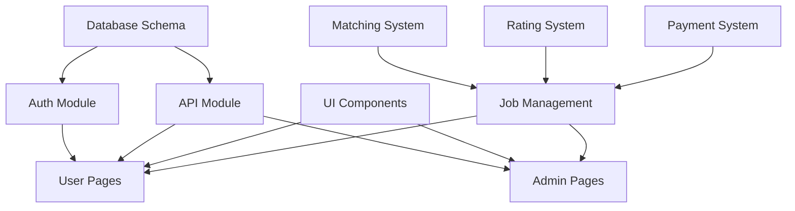

# Linky Platform 재구축 워크플로우

## 🎯 재구축 전략: Systematic + MVP Hybrid

체계적인 기반 구축과 빠른 MVP 출시를 결합한 하이브리드 전략

---

## 📅 Phase 0: 사전 준비 (3일)

### Day 1: 환경 설정
```bash
# Morning (4시간)
- [ ] Supabase 프로젝트 생성 및 설정
- [ ] Vercel 프로젝트 연결
- [ ] 개발 환경 표준화 (.env 파일)
- [ ] Git 브랜치 전략 수립

# Afternoon (4시간)
- [ ] 데이터베이스 백업 스크립트 작성
- [ ] 기존 데이터 마이그레이션 계획
- [ ] 개발 도구 설치 및 설정
- [ ] 팀 역할 및 책임 정의
```

### Day 2: 아키텍처 설계
```bash
# Morning (4시간)
- [ ] 전체 시스템 아키텍처 다이어그램 작성
- [ ] API 명세서 작성 (OpenAPI 3.0)
- [ ] 데이터베이스 ERD 완성
- [ ] 보안 아키텍처 설계

# Afternoon (4시간)
- [ ] UI/UX 디자인 시스템 정의
- [ ] 컴포넌트 라이브러리 구조 설계
- [ ] 상태 관리 전략 결정
- [ ] 테스트 전략 수립
```

### Day 3: 프로토타입 검증
```bash
# Morning (4시간)
- [ ] 핵심 기능 프로토타입 개발
- [ ] 데이터베이스 연결 테스트
- [ ] 인증 플로우 검증
- [ ] API 통신 테스트

# Afternoon (4시간)
- [ ] 프로토타입 리뷰 및 피드백
- [ ] 기술 스택 최종 확정
- [ ] 개발 일정 수립
- [ ] 리스크 평가 및 대응 계획
```

---

## 🏗️ Phase 1: 기초 인프라 (1주)

### Sprint 1.1: 데이터베이스 구축 (2일)
```javascript
// 구현 순서
1. Create Database Schema
   ├── business_users (확장)
   ├── partners (확장)
   ├── jobs ✨ (신규)
   ├── ratings ✨ (신규)
   ├── transactions ✨ (신규)
   └── notifications ✨ (신규)

2. Setup RLS Policies
   ├── User-based access control
   ├── Role-based permissions
   └── Data isolation rules

3. Create Database Functions
   ├── Triggers for updated_at
   ├── Job matching algorithm
   └── Rating calculation
```

**구현 파일:**
- `/sql/schema.sql` - 전체 스키마
- `/sql/migrations/001_initial.sql` - 초기 마이그레이션
- `/sql/functions/` - 데이터베이스 함수
- `/sql/policies/` - RLS 정책

### Sprint 1.2: UI 컴포넌트 라이브러리 (3일)
```javascript
// 컴포넌트 구현 우선순위
Priority 1 (Day 1):
├── Button
├── Input
├── Card
└── Modal

Priority 2 (Day 2):
├── Table
├── Form
├── Select
└── Loading

Priority 3 (Day 3):
├── Navigation
├── Sidebar
├── Header
└── Footer
```

**구현 파일:**
- `/js/components/ui/Button.js`
- `/js/components/ui/Input.js`
- `/js/components/ui/Card.js`
- `/js/components/ui/Modal.js`
- `/js/components/ui/index.js` - 통합 export

### Sprint 1.3: 핵심 모듈 구현 (2일)
```javascript
// 모듈 구현 체크리스트
Auth Module:
- [ ] Login/Logout 함수
- [ ] Session 관리
- [ ] Token 처리
- [ ] User context

API Module:
- [ ] HTTP client 래퍼
- [ ] Error handling
- [ ] Request interceptor
- [ ] Response caching
```

---

## 💼 Phase 2: 비즈니스 로직 (2주)

### Week 1: 작업 관리 시스템
```javascript
// Monday-Tuesday: 작업 CRUD
- [ ] POST /api/jobs - 작업 생성
- [ ] GET /api/jobs - 작업 목록 조회
- [ ] PUT /api/jobs/:id - 작업 수정
- [ ] DELETE /api/jobs/:id - 작업 삭제

// Wednesday-Thursday: 매칭 시스템
- [ ] 파트너 매칭 알고리즘
- [ ] 자동 추천 시스템
- [ ] 지역 기반 필터링
- [ ] 스킬 매칭

// Friday: 상태 관리
- [ ] 작업 상태 전환 로직
- [ ] 알림 트리거
- [ ] 이력 추적
```

### Week 2: 사용자 인터페이스
```javascript
// Business User Pages:
- [ ] business-jobs.html 완전 재구현
- [ ] 작업 생성 폼 구현
- [ ] 작업 목록 테이블
- [ ] 상태 관리 UI

// Partner Pages:
- [ ] partners-works.html 재구현
- [ ] 작업 탐색 UI
- [ ] 지원 시스템
- [ ] 작업 상세 뷰

// Admin Pages:
- [ ] admin-jobs.html 재구현
- [ ] 전체 작업 모니터링
- [ ] 관리 도구
```

---

## 🚀 Phase 3: MVP 완성 (1주)

### Sprint 3.1: 통합 테스트 (2일)
```bash
# Day 1: 기능 테스트
- [ ] 사용자 등록/로그인 플로우
- [ ] 작업 생성 → 매칭 → 완료 플로우
- [ ] 결제 시뮬레이션
- [ ] 알림 시스템

# Day 2: 성능 테스트
- [ ] 페이지 로드 속도 측정
- [ ] API 응답 시간 측정
- [ ] 데이터베이스 쿼리 최적화
- [ ] 프론트엔드 번들 최적화
```

### Sprint 3.2: 버그 수정 및 개선 (2일)
```bash
# Priority 1 - Critical Bugs
- [ ] 인증 관련 버그
- [ ] 데이터 무결성 이슈
- [ ] UI 렌더링 문제

# Priority 2 - UX Improvements
- [ ] 로딩 상태 개선
- [ ] 에러 메시지 개선
- [ ] 폼 검증 강화
```

### Sprint 3.3: 배포 준비 (1일)
```bash
# Deployment Checklist
- [ ] 환경 변수 설정
- [ ] 프로덕션 데이터베이스 설정
- [ ] 모니터링 도구 설정
- [ ] 백업 시스템 구축
- [ ] 배포 스크립트 작성
```

---

## 🔄 Phase 4: 점진적 개선 (2주+)

### 반복 개선 사이클
```yaml
Week 1:
  Monday-Tuesday:
    - 사용자 피드백 수집 및 분석
    - 우선순위 재조정
  
  Wednesday-Thursday:
    - 기능 개선 구현
    - 버그 수정
  
  Friday:
    - 테스트 및 배포
    - 성과 측정

Week 2:
  - 실시간 기능 추가 (WebSocket)
  - 분석 대시보드 구현
  - 성능 최적화
  - 보안 강화
```

---

## 📊 작업 의존성 맵



---

## 🎯 핵심 성공 지표 (KPIs)

### 기술 지표
| 지표 | 목표 | 측정 방법 |
|------|------|----------|
| 페이지 로드 시간 | < 2초 | Lighthouse |
| API 응답 시간 | < 200ms | Monitoring |
| 테스트 커버리지 | > 70% | Jest |
| 에러율 | < 0.1% | Sentry |

### 비즈니스 지표
| 지표 | 목표 | 측정 방법 |
|------|------|----------|
| 작업 매칭률 | > 80% | Analytics |
| 사용자 만족도 | > 4.0/5 | Survey |
| 일일 활성 사용자 | > 100 | Google Analytics |
| 전환율 | > 5% | Funnel Analysis |

---

## 🚨 리스크 관리

### 높은 리스크
1. **데이터 마이그레이션 실패**
   - 완화: 백업 및 롤백 계획
   - 대응: 단계별 마이그레이션

2. **성능 저하**
   - 완화: 프로파일링 및 최적화
   - 대응: 캐싱 전략 구현

### 중간 리스크
1. **일정 지연**
   - 완화: 버퍼 시간 포함
   - 대응: MVP 범위 조정

2. **기술 부채 누적**
   - 완화: 코드 리뷰 프로세스
   - 대응: 리팩토링 스프린트

---

## 🛠️ 도구 및 리소스

### 개발 도구
- **IDE**: VS Code with extensions
- **Version Control**: Git + GitHub
- **Project Management**: Notion/Jira
- **Communication**: Slack/Discord

### 모니터링 도구
- **Error Tracking**: Sentry
- **Performance**: Lighthouse CI
- **Analytics**: Google Analytics
- **Uptime**: UptimeRobot

### 테스트 도구
- **Unit Testing**: Jest
- **E2E Testing**: Cypress
- **API Testing**: Postman
- **Load Testing**: K6

---

## 📝 일일 체크리스트

### 매일 아침 (Standup)
- [ ] 어제 완료한 작업 리뷰
- [ ] 오늘 목표 설정
- [ ] 블로커 확인 및 해결

### 개발 중
- [ ] 코드 커밋 (최소 2회/일)
- [ ] 테스트 작성 및 실행
- [ ] 문서 업데이트

### 매일 저녁 (Wrap-up)
- [ ] 진행 상황 기록
- [ ] 내일 준비사항 확인
- [ ] 리스크 평가

---

## 🎉 마일스톤

### M1: 기초 완성 (Week 1)
- ✅ 데이터베이스 구축 완료
- ✅ UI 컴포넌트 라이브러리 구축
- ✅ 인증 시스템 작동

### M2: MVP 출시 (Week 3)
- ✅ 작업 관리 시스템 작동
- ✅ 3가지 사용자 타입 지원
- ✅ 기본 기능 모두 작동

### M3: 안정화 (Week 5)
- ✅ 버그 < 10개
- ✅ 성능 목표 달성
- ✅ 사용자 피드백 통합

### M4: 확장 (Week 7+)
- ✅ 실시간 기능 추가
- ✅ 분석 대시보드 완성
- ✅ 모바일 최적화

---

이 워크플로우는 Linky Platform의 체계적이고 효율적인 재구축을 위한 상세한 로드맵입니다. 각 단계는 명확한 목표와 검증 가능한 결과물을 가지고 있으며, 지속적인 개선과 확장이 가능한 구조로 설계되었습니다.