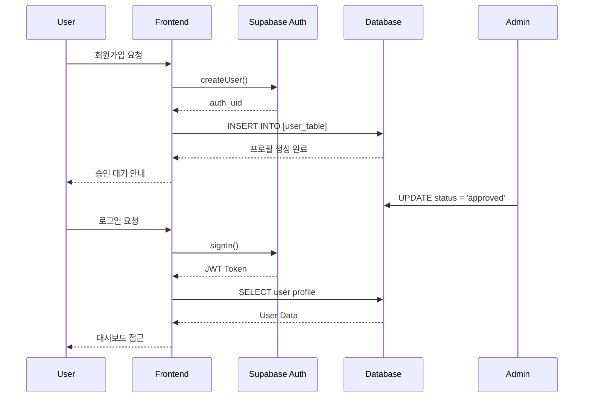

# 🔐 Linky Platform - 인증 시스템 문서

## 🎯 인증 시스템 개요

**인증 제공자**: Supabase Auth  
**인증 방식**: 이메일/비밀번호 기반  
**사용자 구조**: 3-Tier 분리 시스템 (배민 방식)  
**보안 수준**: Row Level Security (RLS) + JWT 토큰

---

## 🏗️ 인증 아키텍처

```
┌─────────────────────────────────────────┐
│           Supabase Auth                 │
│         (auth.users 테이블)              │
│     - 이메일/비밀번호 인증               │
│     - JWT 토큰 발급                      │
│     - 세션 관리                          │
└────────────┬────────────────────────────┘
             │
             ▼
┌─────────────────────────────────────────┐
│        사용자 타입 확인 로직              │
│        get_user_type(auth_uid)          │
└────┬──────────┬──────────┬──────────────┘
     │          │          │
     ▼          ▼          ▼
┌─────────┐ ┌─────────┐ ┌─────────┐
│Business │ │Partner  │ │ Admin   │
│  Users  │ │ Users   │ │ Users   │
└─────────┘ └─────────┘ └─────────┘
```

---

## 👥 사용자 타입별 인증 플로우

### 1. 비즈니스 사용자 (Business Users)

#### 회원가입 프로세스
```javascript
// 1. Supabase Auth에 계정 생성
const { data: authData, error } = await supabase.auth.signUp({
  email: email,
  password: password
});

// 2. business_users 테이블에 프로필 생성
const { data, error } = await supabase
  .from('business_users')
  .insert({
    auth_uid: authData.user.id,
    email: email,
    phone: phone,
    business_name: businessName,
    business_number: businessNumber,
    // ... 기타 필드
    status: 'pending'  // 관리자 승인 대기
  });

// 3. 관리자 승인 후 status → 'approved'
```

#### 로그인 프로세스
```javascript
// 1. Supabase Auth 로그인
const { data, error } = await supabase.auth.signInWithPassword({
  email: email,
  password: password
});

// 2. 사용자 정보 확인
const { data: userData } = await supabase
  .from('business_users')
  .select('*')
  .eq('auth_uid', data.user.id)
  .single();

// 3. 상태 확인
if (userData.status !== 'approved') {
  throw new Error('계정 승인 대기 중입니다.');
}

// 4. 대시보드로 리다이렉트
window.location.href = '/business/dashboard.html';
```

---

### 2. 파트너 사용자 (Partner Users)

#### 회원가입 프로세스
```javascript
// 1. Supabase Auth에 계정 생성
const { data: authData } = await supabase.auth.signUp({
  email: email,
  password: password
});

// 2. partner_users 테이블에 프로필 생성
const { data } = await supabase
  .from('partner_users')
  .insert({
    auth_uid: authData.user.id,
    email: email,
    phone: phone,
    name: name,
    work_areas: selectedAreas,
    // ... 기타 필드
    status: 'pending'  // 관리자 승인 대기
  });

// 3. 신원 확인 후 status → 'approved'
```

#### 로그인 프로세스
```javascript
// 1. Supabase Auth 로그인
const { data } = await supabase.auth.signInWithPassword({
  email: email,
  password: password
});

// 2. 파트너 정보 확인
const { data: partnerData } = await supabase
  .from('partner_users')
  .select('*')
  .eq('auth_uid', data.user.id)
  .single();

// 3. 파트너 대시보드로 이동
window.location.href = '/partners/dashboard.html';
```

---

### 3. 관리자 (Admins)

#### 관리자 로그인
```javascript
// 1. 관리자 전용 로그인 페이지에서 인증
const { data } = await supabase.auth.signInWithPassword({
  email: email,
  password: password
});

// 2. 관리자 권한 확인
const { data: adminData } = await supabase
  .from('admins')
  .select('*')
  .eq('auth_uid', data.user.id)
  .single();

if (!adminData) {
  throw new Error('관리자 권한이 없습니다.');
}

// 3. 관리자 대시보드로 이동
window.location.href = '/admin/dashboard.html';
```

---

## 🔧 인증 관련 주요 함수

### 1. 사용자 타입 확인 (`get_user_type`)
```sql
CREATE OR REPLACE FUNCTION get_user_type(user_id UUID)
RETURNS TEXT AS $$
BEGIN
  IF EXISTS (SELECT 1 FROM business_users WHERE auth_uid = user_id) THEN
    RETURN 'business';
  ELSIF EXISTS (SELECT 1 FROM partner_users WHERE auth_uid = user_id) THEN
    RETURN 'partner';
  ELSIF EXISTS (SELECT 1 FROM admins WHERE auth_uid = user_id) THEN
    RETURN 'admin';
  ELSE
    RETURN NULL;
  END IF;
END;
$$ LANGUAGE plpgsql;
```

### 2. JavaScript 인증 헬퍼 함수
```javascript
// auth-utils.js

// 현재 사용자 타입 가져오기
async function getCurrentUserType() {
  const { data: { user } } = await supabase.auth.getUser();
  if (!user) return null;
  
  const { data } = await supabase
    .rpc('get_user_type', { user_id: user.id });
  
  return data;
}

// 페이지 접근 권한 확인
async function checkPageAccess(requiredType) {
  const userType = await getCurrentUserType();
  
  if (!userType) {
    // 로그인 필요
    window.location.href = '/login.html';
    return false;
  }
  
  if (userType !== requiredType) {
    // 권한 없음
    alert('접근 권한이 없습니다.');
    window.location.href = '/';
    return false;
  }
  
  return true;
}

// 로그아웃
async function logout() {
  await supabase.auth.signOut();
  window.location.href = '/';
}
```

---

## 🔒 보안 정책

### Row Level Security (RLS) 정책

#### business_users 테이블
```sql
-- 본인 데이터만 조회 가능
ALTER TABLE business_users ENABLE ROW LEVEL SECURITY;

CREATE POLICY "Users can view own profile" ON business_users
  FOR SELECT USING (auth.uid() = auth_uid);

CREATE POLICY "Users can update own profile" ON business_users
  FOR UPDATE USING (auth.uid() = auth_uid);
```

#### partner_users 테이블
```sql
-- 본인 데이터만 조회/수정 가능
ALTER TABLE partner_users ENABLE ROW LEVEL SECURITY;

CREATE POLICY "Partners can view own profile" ON partner_users
  FOR SELECT USING (auth.uid() = auth_uid);

CREATE POLICY "Partners can update own profile" ON partner_users
  FOR UPDATE USING (auth.uid() = auth_uid);
```

#### admins 테이블
```sql
-- 관리자만 접근 가능
ALTER TABLE admins ENABLE ROW LEVEL SECURITY;

CREATE POLICY "Only admins can access" ON admins
  FOR ALL USING (
    auth.uid() IN (SELECT auth_uid FROM admins)
  );
```

---

## 🚦 인증 상태 관리

### 세션 관리
```javascript
// 인증 상태 리스너
supabase.auth.onAuthStateChange((event, session) => {
  switch(event) {
    case 'SIGNED_IN':
      console.log('User signed in:', session.user.email);
      handleSignIn(session.user);
      break;
      
    case 'SIGNED_OUT':
      console.log('User signed out');
      handleSignOut();
      break;
      
    case 'TOKEN_REFRESHED':
      console.log('Token refreshed');
      break;
      
    case 'USER_UPDATED':
      console.log('User data updated');
      refreshUserData(session.user);
      break;
  }
});
```

### 토큰 관리
```javascript
// JWT 토큰 가져오기
async function getAccessToken() {
  const { data: { session } } = await supabase.auth.getSession();
  return session?.access_token;
}

// 토큰 갱신
async function refreshToken() {
  const { data, error } = await supabase.auth.refreshSession();
  if (error) {
    console.error('Token refresh failed:', error);
    // 재로그인 필요
    window.location.href = '/login.html';
  }
  return data.session;
}
```

---

## 📱 모듈별 인증 구현

### 1. business-auth.js
```javascript
// 비즈니스 사용자 전용 인증 모듈
export class BusinessAuth {
  async login(email, password) {
    // Supabase 로그인
    // business_users 확인
    // 승인 상태 확인
    // 대시보드 리다이렉트
  }
  
  async signup(businessData) {
    // 계정 생성
    // 프로필 생성
    // 승인 대기 안내
  }
  
  async updateProfile(updates) {
    // 프로필 업데이트
  }
}
```

### 2. partner-auth.js
```javascript
// 파트너 사용자 전용 인증 모듈
export class PartnerAuth {
  async login(email, password) {
    // Supabase 로그인
    // partner_users 확인
    // 활동 상태 확인
    // 대시보드 리다이렉트
  }
  
  async signup(partnerData) {
    // 계정 생성
    // 프로필 생성
    // 신원 확인 안내
  }
  
  async updateWorkAreas(areas) {
    // 활동 지역 업데이트
  }
}
```

### 3. admin-auth.js
```javascript
// 관리자 전용 인증 모듈
export class AdminAuth {
  async login(email, password) {
    // Supabase 로그인
    // 관리자 권한 확인
    // 2FA 확인 (추후 구현)
    // 관리 대시보드 리다이렉트
  }
  
  async checkPermission(action) {
    // 특정 작업에 대한 권한 확인
  }
}
```

---

## 🛡️ 보안 모범 사례

### 1. 비밀번호 정책
- 최소 8자 이상
- 대소문자, 숫자, 특수문자 포함 권장
- 정기적인 변경 권고

### 2. 세션 보안
- HTTPS 전용
- Secure, HttpOnly 쿠키 사용
- 30분 무활동 시 자동 로그아웃

### 3. API 보안
- Rate Limiting 적용
- CORS 정책 설정
- API Key 노출 방지

### 4. 데이터 보안
- 민감 정보 암호화
- SQL Injection 방지
- XSS 공격 방지

---

## 🔄 인증 플로우 다이어그램



---

## 🔍 트러블슈팅

### 일반적인 문제와 해결책

1. **"Invalid login credentials"**
   - 이메일/비밀번호 확인
   - 계정 승인 상태 확인

2. **"User not found in [table]"**
   - auth.users와 프로필 테이블 동기화 확인
   - 회원가입 프로세스 완료 여부 확인

3. **"Permission denied"**
   - RLS 정책 확인
   - 사용자 타입 확인

4. **"Token expired"**
   - 토큰 갱신 로직 확인
   - 세션 만료 시간 설정 확인

---

**최종 업데이트**: 2025-01-23  
**문서 버전**: 1.0